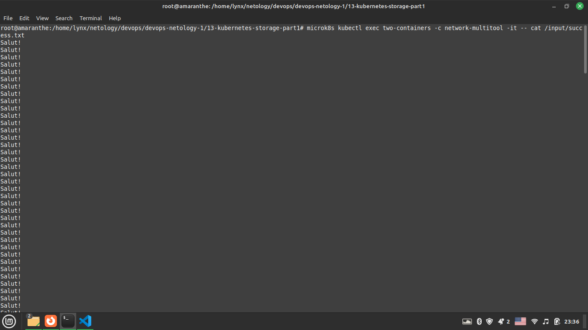
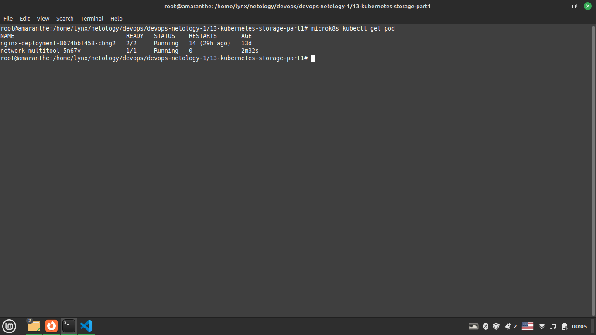
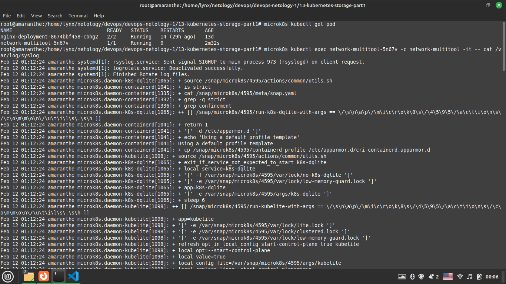

# Домашнее задание к занятию "Хранение в K8s. Часть 1"

### Цель задания

В тестовой среде Kubernetes необходимо обеспечить обмен файлами между контейнерам пода и доступ к логам ноды.

------

### Задание 1. Создать Deployment приложения, состоящего из двух контейнеров и обменивающихся данными

1. Создать Deployment приложения, состоящего из контейнеров busybox и multitool.
2. Сделать так, чтобы busybox писал каждые 5 секунд в некий файл в общей директории.
3. Обеспечить возможность чтения файла контейнером multitool.
4. Продемонстрировать, что multitool может читать файл, который периодически обновляется.
5. Предоставить манифесты Deployment'а в решении, а также скриншоты или вывод команды п.4

### Решение

[Конфиг Pod1]:https://github.com/flibook/devops-netology/blob/main/13-kubernetes-storage-part1/deployment.yaml  
  

------

### Задание 2. Создать DaemonSet приложения, которое может прочитать логи ноды

1. Создать DaemonSet приложения состоящего из multitool.
2. Обеспечить возможность чтения файла `/var/log/syslog` кластера microK8S.
3. Продемонстрировать возможность чтения файла изнутри пода.
4. Предоставить манифесты Deployment, а также скриншоты или вывод команды п.2

### Решение

[Конфиг Pod1]:https://github.com/flibook/devops-netology/blob/main/13-kubernetes-storage-part1/daemonset.yaml  
  
  

------

### Правила приема работы

1. Домашняя работа оформляется в своем Git репозитории в файле README.md. Выполненное домашнее задание пришлите ссылкой на .md-файл в вашем репозитории.
2. Файл README.md должен содержать скриншоты вывода необходимых команд `kubectl`, а также скриншоты результатов
3. Репозиторий должен содержать тексты манифестов или ссылки на них в файле README.md

------
