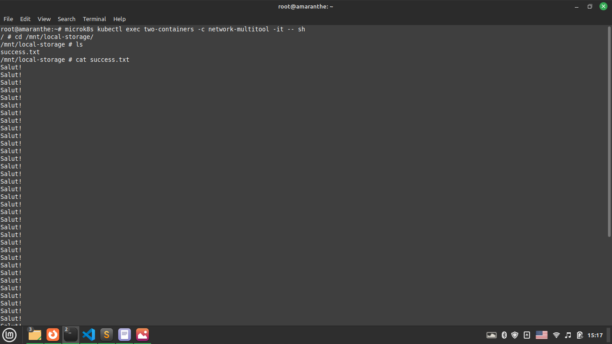

# Домашнее задание к занятию "Хранение в K8s. Часть 2"

### Цель задания

В тестовой среде Kubernetes необходимо создать PV и продемострировать запись и хранение файлов.

------

### Задание 1. Создать Deployment приложения, использующего локальный PV, созданный вручную

1. Создать Deployment приложения состоящего из контейнеров busybox и multitool.
2. Создать PV и PVC для подключения папки на локальной ноде, которая будет использована в поде.
3. Продемонстрировать, что multitool может читать файл, в который busybox пишет каждые 5 секунд в общей директории. 
4. Продемонстрировать, что файл сохранился на локальном диске ноды, а также что произойдет с файлом после удаления пода и deployment'а. Почему?
5. Предоставить манифесты, а также скриншоты и/или вывод необходимых команд.

### Решение

[Конфиг Pod]:https://github.com/flibook/devops-netology/blob/main/13-kubernetes-storage-part2/deployment.yaml  

  
  

По очереди были удалены pod, pvc, pc, sc - локальный файл сохранился.
Я, честно говоря, не понял почему остался файл, учитывая ReclaimPolicy=Delete. Возможно, потому что это работает только с облачными хранилищами. Или из-за отсутствия провизионера для local-storage.

------

### Задание 2. Создать Deployment приложения, которое может хранить файлы на NFS с динамическим созданием PV

1. Включить и настроить NFS-сервер на microK8S.
2. Создать Deployment приложения состоящего из multitool и подключить к нему PV, созданный автоматически на сервере NFS
3. Продемонстрировать возможность чтения и записи файла изнутри пода. 
4. Предоставить манифесты, а также скриншоты и/или вывод необходимых команд.

### Решение

У меня какая-то проблема с установкой поддержки nfs. Все сделано по инструкции, но после 

microk8s kubectl wait pod --selector app.kubernetes.io/name=csi-driver-nfs --for condition=ready --namespace kube-system

появляется ошибка

 condition=ready --namespace kube-system
timed out waiting for the condition on pods/csi-nfs-node-c22mc
timed out waiting for the condition on pods/csi-nfs-controller-f9bd9cfc-n6tld.

[Конфиг Pod]:https://github.com/flibook/devops-netology/blob/main/13-kubernetes-storage-part2/deployment-nfs.yaml  
------

### Правила приема работы

1. Домашняя работа оформляется в своем Git репозитории в файле README.md. Выполненное домашнее задание пришлите ссылкой на .md-файл в вашем репозитории.
2. Файл README.md должен содержать скриншоты вывода необходимых команд `kubectl`, а также скриншоты результатов
3. Репозиторий должен содержать тексты манифестов или ссылки на них в файле README.md
