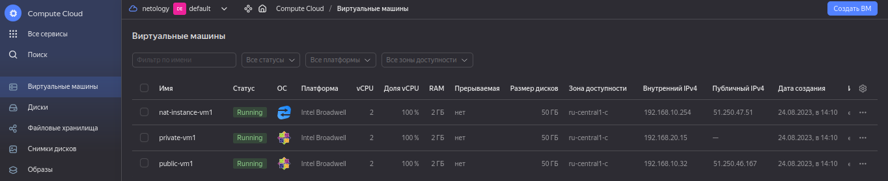

# Домашнее задание к занятию «Организация сети»
«Организация сети»


### Подготовка к выполнению задания

1. Домашнее задание состоит из обязательной части, которую нужно выполнить на провайдере Yandex Cloud, и дополнительной части в AWS (выполняется по желанию). 
2. Все домашние задания в блоке 15 связаны друг с другом и в конце представляют пример законченной инфраструктуры.  
3. Все задания нужно выполнить с помощью Terraform. Результатом выполненного домашнего задания будет код в репозитории. 
4. Перед началом работы настройте доступ к облачным ресурсам из Terraform, используя материалы прошлых лекций и домашнее задание по теме «Облачные провайдеры и синтаксис Terraform». Заранее выберите регион (в случае AWS) и зону.

---
### Задание 1. Yandex Cloud 

**Что нужно сделать**

1. Создать пустую VPC. Выбрать зону.
2. Публичная подсеть.

 - Создать в VPC subnet с названием public, сетью 192.168.10.0/24.
 - Создать в этой подсети NAT-инстанс, присвоив ему адрес 192.168.10.254. В качестве image_id использовать fd80mrhj8fl2oe87o4e1.
 - Создать в этой публичной подсети виртуалку с публичным IP, подключиться к ней и убедиться, что есть доступ к интернету.
3. Приватная подсеть.
 - Создать в VPC subnet с названием private, сетью 192.168.20.0/24.
 - Создать route table. Добавить статический маршрут, направляющий весь исходящий трафик private сети в NAT-инстанс.
 - Создать в этой приватной подсети виртуалку с внутренним IP, подключиться к ней через виртуалку, созданную ранее, и убедиться, что есть доступ к интернету.

Resource Terraform для Yandex Cloud:

- [VPC subnet](https://registry.terraform.io/providers/yandex-cloud/yandex/latest/docs/resources/vpc_subnet).
- [Route table](https://registry.terraform.io/providers/yandex-cloud/yandex/latest/docs/resources/vpc_route_table).
- [Compute Instance](https://registry.terraform.io/providers/yandex-cloud/yandex/latest/docs/resources/compute_instance).

#### Решение

- [Terraform](https://github.com/flibook/devops-netology/tree/main/15.1-clokub-1-network/terraform) 


```bash
root@amarathe:~/terraform# terraform plan
yandex_vpc_network.network-1: Refreshing state... [id=enptp9tiqvubs6qg125q]
yandex_vpc_subnet.subnet-public: Refreshing state... [id=b0c9i7pu6p65cokrev31]
yandex_vpc_route_table.nat-route-table: Refreshing state... [id=enp0o058ptdsosfconha]
yandex_compute_instance.nat-instance: Refreshing state... [id=ef3j2o27deovpt8u41rq]
yandex_vpc_subnet.subnet-private: Refreshing state... [id=b0cp3n1gh0r2901fov0j]

Terraform used the selected providers to generate the following execution plan. Resource actions are indicated with the following symbols:
  + create
-/+ destroy and then create replacement

Terraform will perform the following actions:

  # yandex_compute_instance.nat-instance must be replaced
-/+ resource "yandex_compute_instance" "nat-instance" {
      ~ created_at                = "2023-08-24T10:39:01Z" -> (known after apply)
      ~ folder_id                 = "b1gev769hlkfpj3ori2p" -> (known after apply)
      ~ fqdn                      = "nat-instance-vm1.netology" -> (known after apply)
      + gpu_cluster_id            = (known after apply)
      ~ id                        = "ef3j2o27deovpt8u41rq" -> (known after apply)
      - labels                    = {} -> null
        name                      = "nat-instance-vm1"
      + service_account_id        = (known after apply)
      ~ status                    = "running" -> (known after apply)
        # (5 unchanged attributes hidden)

      ~ boot_disk {
          ~ device_name = "ef3c3oc9vfpbv3696o75" -> (known after apply)
          ~ disk_id     = "ef3c3oc9vfpbv3696o75" -> (known after apply)
          ~ mode        = "READ_WRITE" -> (known after apply)
            # (1 unchanged attribute hidden)

          ~ initialize_params {
              ~ block_size  = 4096 -> (known after apply)
              + description = (known after apply)
                name        = "root-nat-instance-vm1"
              + snapshot_id = (known after apply)
              ~ type        = "network-ssd" -> "network-nvme" # forces replacement
                # (2 unchanged attributes hidden)
            }
        }

      - metadata_options {
          - aws_v1_http_endpoint = 1 -> null
          - aws_v1_http_token    = 2 -> null
          - gce_http_endpoint    = 1 -> null
          - gce_http_token       = 1 -> null
        }

      ~ network_interface {
          ~ index              = 0 -> (known after apply)
          ~ ipv6               = false -> (known after apply)
          + ipv6_address       = (known after apply)
          ~ mac_address        = "d0:0d:13:16:04:76" -> (known after apply)
          ~ nat_ip_address     = "51.250.35.106" -> (known after apply)
          ~ nat_ip_version     = "IPV4" -> (known after apply)
          ~ security_group_ids = [] -> (known after apply)
            # (4 unchanged attributes hidden)
        }

      - placement_policy {
          - host_affinity_rules = [] -> null
        }

      ~ resources {
          - gpus          = 0 -> null
            # (3 unchanged attributes hidden)
        }

      - scheduling_policy {
          - preemptible = false -> null
        }
    }

  # yandex_compute_instance.private-vm will be created
  + resource "yandex_compute_instance" "private-vm" {
      + created_at                = (known after apply)
      + folder_id                 = (known after apply)
      + fqdn                      = (known after apply)
      + gpu_cluster_id            = (known after apply)
      + hostname                  = "private-vm1.netology"
      + id                        = (known after apply)
      + metadata                  = {
          + "ssh-keys" = <<-EOT
                ubuntu:ssh-rsa AAAAB3NzaC1yc2EAAAADAQABAAABgQC0EIzPKVC0yjcd6SQXqv9rapzXhdX/Ooe/i1l2HpKyos0K6Xddnb/ujuQnu3Y6R9147IjdRYf/+A8KI3cquEzded3iWI0tukxAkek7yF5LEXBeJmCwkBZYo6AHngcbV7h6GABV2PJSIAlpQGM7XSPfWyBJR1ZIpp9CZRlcQyTY3TXsU06cIJ8o5vMpLReaD4RMZaeAiPo/jHhLdVE/oFyZVX2RELX1t844b2kPOYxMbCVtqN/sa/k9CnPMxMthyHBayvvPc9G0QFkm9ZxevW/lcsNQFeR2kGr9bnzTyYTZHS9slxsnNdBoKM/5DRAmSEijoA9Y2/3NoOj5jc5NzRw7RYEihJyWR7orEUHIUBVKJvTtl+5SUvL0NE+JOGOmKnPjGEPY0/3YbakQ8zcR1nIphYVCQKIfFjAct20mscqwPMzGyCBtVgWqau3A7O9ClVVFkKG2zCDQg0G7bcRxAxqImiAGunq1QGz6lszb86WLLT8xiVUjnPHPYDb2fboz090= root@Akopyan-M
            EOT
        }
      + name                      = "private-vm1"
      + network_acceleration_type = "standard"
      + platform_id               = "standard-v1"
      + service_account_id        = (known after apply)
      + status                    = (known after apply)
      + zone                      = "ru-central1-c"

      + boot_disk {
          + auto_delete = true
          + device_name = (known after apply)
          + disk_id     = (known after apply)
          + mode        = (known after apply)

          + initialize_params {
              + block_size  = (known after apply)
              + description = (known after apply)
              + image_id    = "fd8b88l2b5mnj352lkdk"
              + name        = "root-private-vm1"
              + size        = 50
              + snapshot_id = (known after apply)
              + type        = "network-nvme"
            }
        }

      + network_interface {
          + index              = (known after apply)
          + ip_address         = (known after apply)
          + ipv4               = true
          + ipv6               = (known after apply)
          + ipv6_address       = (known after apply)
          + mac_address        = (known after apply)
          + nat                = false
          + nat_ip_address     = (known after apply)
          + nat_ip_version     = (known after apply)
          + security_group_ids = (known after apply)
          + subnet_id          = "b0cp3n1gh0r2901fov0j"
        }

      + resources {
          + core_fraction = 100
          + cores         = 2
          + memory        = 2
        }
    }

  # yandex_compute_instance.public-vm will be created
  + resource "yandex_compute_instance" "public-vm" {
      + created_at                = (known after apply)
      + folder_id                 = (known after apply)
      + fqdn                      = (known after apply)
      + gpu_cluster_id            = (known after apply)
      + hostname                  = "public-vm1.netology"
      + id                        = (known after apply)
      + metadata                  = {
          + "ssh-keys" = <<-EOT
                ubuntu:ssh-rsa AAAAB3NzaC1yc2EAAAADAQABAAABgQC0EIzPKVC0yjcd6SQXqv9rapzXhdX/Ooe/i1l2HpKyos0K6Xddnb/ujuQnu3Y6R9147IjdRYf/+A8KI3cquEzded3iWI0tukxAkek7yF5LEXBeJmCwkBZYo6AHngcbV7h6GABV2PJSIAlpQGM7XSPfWyBJR1ZIpp9CZRlcQyTY3TXsU06cIJ8o5vMpLReaD4RMZaeAiPo/jHhLdVE/oFyZVX2RELX1t844b2kPOYxMbCVtqN/sa/k9CnPMxMthyHBayvvPc9G0QFkm9ZxevW/lcsNQFeR2kGr9bnzTyYTZHS9slxsnNdBoKM/5DRAmSEijoA9Y2/3NoOj5jc5NzRw7RYEihJyWR7orEUHIUBVKJvTtl+5SUvL0NE+JOGOmKnPjGEPY0/3YbakQ8zcR1nIphYVCQKIfFjAct20mscqwPMzGyCBtVgWqau3A7O9ClVVFkKG2zCDQg0G7bcRxAxqImiAGunq1QGz6lszb86WLLT8xiVUjnPHPYDb2fboz090= root@Akopyan-M
            EOT
        }
      + name                      = "public-vm1"
      + network_acceleration_type = "standard"
      + platform_id               = "standard-v1"
      + service_account_id        = (known after apply)
      + status                    = (known after apply)
      + zone                      = "ru-central1-c"

      + boot_disk {
          + auto_delete = true
          + device_name = (known after apply)
          + disk_id     = (known after apply)
          + mode        = (known after apply)

          + initialize_params {
              + block_size  = (known after apply)
              + description = (known after apply)
              + image_id    = "fd8b88l2b5mnj352lkdk"
              + name        = "root-public-vm1"
              + size        = 50
              + snapshot_id = (known after apply)
              + type        = "network-nvme"
            }
        }

      + network_interface {
          + index              = (known after apply)
          + ip_address         = (known after apply)
          + ipv4               = true
          + ipv6               = (known after apply)
          + ipv6_address       = (known after apply)
          + mac_address        = (known after apply)
          + nat                = true
          + nat_ip_address     = (known after apply)
          + nat_ip_version     = (known after apply)
          + security_group_ids = (known after apply)
          + subnet_id          = "b0c9i7pu6p65cokrev31"
        }

      + resources {
          + core_fraction = 100
          + cores         = 2
          + memory        = 2
        }
    }

Plan: 3 to add, 0 to change, 1 to destroy.

Changes to Outputs:
  ~ external_ip_address_nat_vm     = "51.250.35.106" -> (known after apply)
  + external_ip_address_private_vm = (known after apply)
  + external_ip_address_public_vm  = (known after apply)
  + internal_ip_address_private_vm = (known after apply)
  + internal_ip_address_public_vm  = (known after apply)
```

```bash
root@amaranthe:~/terraform# terraform apply -auto-approve
...........................................
.................................
yandex_vpc_network.network-1: Refreshing state... [id=enptp9tiqvubs6qg125q]
yandex_vpc_route_table.nat-route-table: Refreshing state... [id=enp0o058ptdsosfconha]
yandex_vpc_subnet.subnet-public: Refreshing state... [id=b0c9i7pu6p65cokrev31]
yandex_vpc_subnet.subnet-private: Refreshing state... [id=b0cp3n1gh0r2901fov0j]
yandex_compute_instance.nat-instance: Refreshing state... [id=ef3j2o27deovpt8u41rq]

Terraform used the selected providers to generate the following execution plan. Resource actions are indicated with the following symbols:
  + create
-/+ destroy and then create replacement

Terraform will perform the following actions:

  # yandex_compute_instance.nat-instance must be replaced
-/+ resource "yandex_compute_instance" "nat-instance" {
      ~ created_at                = "2023-08-24T10:39:01Z" -> (known after apply)
      ~ folder_id                 = "b1gev769hlkfpj3ori2p" -> (known after apply)
      ~ fqdn                      = "nat-instance-vm1.netology" -> (known after apply)
      + gpu_cluster_id            = (known after apply)
      ~ id                        = "ef3j2o27deovpt8u41rq" -> (known after apply)
      - labels                    = {} -> null
        name                      = "nat-instance-vm1"
      + service_account_id        = (known after apply)
      ~ status                    = "running" -> (known after apply)
        # (5 unchanged attributes hidden)

      ~ boot_disk {
          ~ device_name = "ef3c3oc9vfpbv3696o75" -> (known after apply)
          ~ disk_id     = "ef3c3oc9vfpbv3696o75" -> (known after apply)
          ~ mode        = "READ_WRITE" -> (known after apply)
            # (1 unchanged attribute hidden)

          ~ initialize_params {
              ~ block_size  = 4096 -> (known after apply)
              + description = (known after apply)
                name        = "root-nat-instance-vm1"
              + snapshot_id = (known after apply)
              ~ type        = "network-ssd" -> "network-nvme" # forces replacement
                # (2 unchanged attributes hidden)
            }
        }

      - metadata_options {
          - aws_v1_http_endpoint = 1 -> null
          - aws_v1_http_token    = 2 -> null
          - gce_http_endpoint    = 1 -> null
          - gce_http_token       = 1 -> null
        }

      ~ network_interface {
          ~ index              = 0 -> (known after apply)
          ~ ipv6               = false -> (known after apply)
          + ipv6_address       = (known after apply)
          ~ mac_address        = "d0:0d:13:16:04:76" -> (known after apply)
          ~ nat_ip_address     = "51.250.35.106" -> (known after apply)
          ~ nat_ip_version     = "IPV4" -> (known after apply)
          ~ security_group_ids = [] -> (known after apply)
            # (4 unchanged attributes hidden)
        }

      - placement_policy {
          - host_affinity_rules = [] -> null
        }

      ~ resources {
          - gpus          = 0 -> null
            # (3 unchanged attributes hidden)
        }

      - scheduling_policy {
          - preemptible = false -> null
        }
    }

  # yandex_compute_instance.private-vm will be created
  + resource "yandex_compute_instance" "private-vm" {
      + created_at                = (known after apply)
      + folder_id                 = (known after apply)
      + fqdn                      = (known after apply)
      + gpu_cluster_id            = (known after apply)
      + hostname                  = "private-vm1.netology"
      + id                        = (known after apply)
      + metadata                  = {
          + "ssh-keys" = <<-EOT
                ubuntu:ssh-rsa AAAAB3NzaC1yc2EAAAADAQABAAABgQC0EIzPKVC0yjcd6SQXqv9rapzXhdX/Ooe/i1l2HpKyos0K6Xddnb/ujuQnu3Y6R9147IjdRYf/+A8KI3cquEzded3iWI0tukxAkek7yF5LEXBeJmCwkBZYo6AHngcbV7h6GABV2PJSIAlpQGM7XSPfWyBJR1ZIpp9CZRlcQyTY3TXsU06cIJ8o5vMpLReaD4RMZaeAiPo/jHhLdVE/oFyZVX2RELX1t844b2kPOYxMbCVtqN/sa/k9CnPMxMthyHBayvvPc9G0QFkm9ZxevW/lcsNQFeR2kGr9bnzTyYTZHS9slxsnNdBoKM/5DRAmSEijoA9Y2/3NoOj5jc5NzRw7RYEihJyWR7orEUHIUBVKJvTtl+5SUvL0NE+JOGOmKnPjGEPY0/3YbakQ8zcR1nIphYVCQKIfFjAct20mscqwPMzGyCBtVgWqau3A7O9ClVVFkKG2zCDQg0G7bcRxAxqImiAGunq1QGz6lszb86WLLT8xiVUjnPHPYDb2fboz090= root@Akopyan-M
            EOT
        }
      + name                      = "private-vm1"
      + network_acceleration_type = "standard"
      + platform_id               = "standard-v1"
      + service_account_id        = (known after apply)
      + status                    = (known after apply)
      + zone                      = "ru-central1-c"

      + boot_disk {
          + auto_delete = true
          + device_name = (known after apply)
          + disk_id     = (known after apply)
          + mode        = (known after apply)

          + initialize_params {
              + block_size  = (known after apply)
              + description = (known after apply)
              + image_id    = "fd8b88l2b5mnj352lkdk"
              + name        = "root-private-vm1"
              + size        = 50
              + snapshot_id = (known after apply)
              + type        = "network-nvme"
            }
        }

      + network_interface {
          + index              = (known after apply)
          + ip_address         = (known after apply)
          + ipv4               = true
          + ipv6               = (known after apply)
          + ipv6_address       = (known after apply)
          + mac_address        = (known after apply)
          + nat                = false
          + nat_ip_address     = (known after apply)
          + nat_ip_version     = (known after apply)
          + security_group_ids = (known after apply)
          + subnet_id          = "b0cp3n1gh0r2901fov0j"
        }

      + resources {
          + core_fraction = 100
          + cores         = 2
          + memory        = 2
        }
    }

  # yandex_compute_instance.public-vm will be created
  + resource "yandex_compute_instance" "public-vm" {
      + created_at                = (known after apply)
      + folder_id                 = (known after apply)
      + fqdn                      = (known after apply)
      + gpu_cluster_id            = (known after apply)
      + hostname                  = "public-vm1.netology"
      + id                        = (known after apply)
      + metadata                  = {
          + "ssh-keys" = <<-EOT
                ubuntu:ssh-rsa AAAAB3NzaC1yc2EAAAADAQABAAABgQC0EIzPKVC0yjcd6SQXqv9rapzXhdX/Ooe/i1l2HpKyos0K6Xddnb/ujuQnu3Y6R9147IjdRYf/+A8KI3cquEzded3iWI0tukxAkek7yF5LEXBeJmCwkBZYo6AHngcbV7h6GABV2PJSIAlpQGM7XSPfWyBJR1ZIpp9CZRlcQyTY3TXsU06cIJ8o5vMpLReaD4RMZaeAiPo/jHhLdVE/oFyZVX2RELX1t844b2kPOYxMbCVtqN/sa/k9CnPMxMthyHBayvvPc9G0QFkm9ZxevW/lcsNQFeR2kGr9bnzTyYTZHS9slxsnNdBoKM/5DRAmSEijoA9Y2/3NoOj5jc5NzRw7RYEihJyWR7orEUHIUBVKJvTtl+5SUvL0NE+JOGOmKnPjGEPY0/3YbakQ8zcR1nIphYVCQKIfFjAct20mscqwPMzGyCBtVgWqau3A7O9ClVVFkKG2zCDQg0G7bcRxAxqImiAGunq1QGz6lszb86WLLT8xiVUjnPHPYDb2fboz090= root@Akopyan-M
            EOT
        }
      + name                      = "public-vm1"
      + network_acceleration_type = "standard"
      + platform_id               = "standard-v1"
      + service_account_id        = (known after apply)
      + status                    = (known after apply)
      + zone                      = "ru-central1-c"

      + boot_disk {
          + auto_delete = true
          + device_name = (known after apply)
          + disk_id     = (known after apply)
          + mode        = (known after apply)

          + initialize_params {
              + block_size  = (known after apply)
              + description = (known after apply)
              + image_id    = "fd8b88l2b5mnj352lkdk"
              + name        = "root-public-vm1"
              + size        = 50
              + snapshot_id = (known after apply)
              + type        = "network-nvme"
            }
        }

      + network_interface {
          + index              = (known after apply)
          + ip_address         = (known after apply)
          + ipv4               = true
          + ipv6               = (known after apply)
          + ipv6_address       = (known after apply)
          + mac_address        = (known after apply)
          + nat                = true
          + nat_ip_address     = (known after apply)
          + nat_ip_version     = (known after apply)
          + security_group_ids = (known after apply)
          + subnet_id          = "b0c9i7pu6p65cokrev31"
        }

      + resources {
          + core_fraction = 100
          + cores         = 2
          + memory        = 2
        }
    }

Plan: 3 to add, 0 to change, 1 to destroy.

Changes to Outputs:
  ~ external_ip_address_nat_vm     = "51.250.35.106" -> (known after apply)
  + external_ip_address_private_vm = (known after apply)
  + external_ip_address_public_vm  = (known after apply)
  + internal_ip_address_private_vm = (known after apply)
  + internal_ip_address_public_vm  = (known after apply)

Do you want to perform these actions?
  Terraform will perform the actions described above.
  Only 'yes' will be accepted to approve.

  Enter a value: yes

yandex_compute_instance.nat-instance: Destroying... [id=ef3j2o27deovpt8u41rq]
yandex_compute_instance.private-vm: Creating...
yandex_compute_instance.public-vm: Creating...
yandex_compute_instance.nat-instance: Still destroying... [id=ef3j2o27deovpt8u41rq, 10s elapsed]
yandex_compute_instance.private-vm: Still creating... [10s elapsed]
yandex_compute_instance.public-vm: Still creating... [10s elapsed]
yandex_compute_instance.nat-instance: Still destroying... [id=ef3j2o27deovpt8u41rq, 20s elapsed]
yandex_compute_instance.private-vm: Still creating... [20s elapsed]
yandex_compute_instance.public-vm: Still creating... [20s elapsed]
yandex_compute_instance.nat-instance: Destruction complete after 24s
yandex_compute_instance.nat-instance: Creating...
yandex_compute_instance.private-vm: Still creating... [30s elapsed]
yandex_compute_instance.public-vm: Still creating... [30s elapsed]
yandex_compute_instance.nat-instance: Still creating... [10s elapsed]
yandex_compute_instance.private-vm: Creation complete after 35s [id=ef3peougafck8in9seoh]
yandex_compute_instance.public-vm: Creation complete after 40s [id=ef3pmvdeh7dce7oo7h47]
yandex_compute_instance.nat-instance: Still creating... [20s elapsed]
yandex_compute_instance.nat-instance: Still creating... [30s elapsed]
yandex_compute_instance.nat-instance: Still creating... [40s elapsed]
yandex_compute_instance.nat-instance: Still creating... [50s elapsed]
yandex_compute_instance.nat-instance: Creation complete after 51s [id=ef3jmqhttkr6atnf6li8]

Apply complete! Resources: 3 added, 0 changed, 1 destroyed.

Outputs:

external_ip_address_nat_vm = "51.250.47.51"
external_ip_address_private_vm = ""
external_ip_address_public_vm = "51.250.46.167"
internal_ip_address_nat_vm = "192.168.10.254"
internal_ip_address_private_vm = "192.168.20.15"
internal_ip_address_public_vm = "192.168.10.32"
```

Виртуальные машины



Подсети


Таблицы маршрутизации


Проверка интернета с public


```bash
root@amaranthe:~/terraform# terraform destroy -auto-approve
.......................
...........
Destroy complete! Resources: 7 destroyed.
```

---

Resource Terraform:

1. [VPC](https://registry.terraform.io/providers/hashicorp/aws/latest/docs/resources/vpc).
1. [Subnet](https://registry.terraform.io/providers/hashicorp/aws/latest/docs/resources/subnet).
1. [Internet Gateway](https://registry.terraform.io/providers/hashicorp/aws/latest/docs/resources/internet_gateway).